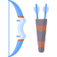

<h1>Hi, I'm Alex! I'm a fullstack developer.</h1>

I am interested in web development and full stack apps. My favorite stack at the moment is a combo of Vue.js/Nuxt.js with Typescript. I use a few ORMs, and PostgreSQL to handle data, and multiple components libraries for the frontend. This GitHub profile contains personal projects that I am free to share publicly.

<h2><a href='https://agilbert.dev'>Portfolio</a>&emsp;<a href='https://www.linkedin.com/in/AGilbertDev/'>Linkedin</a>&emsp;<a href='https://leetcode.com/AGilbertDev/'>Leetcode</a></h2>

<h2>Main stack</h2>
	<table>
		<tr>
			<td align='center'>
				
				<h3>Bun</h3>
			</td>
			<td align='center'>
				
				<h3>PostgreSQL</h3>
			</td>
			<td align='center'>
				
				<h3>TypeScript</h3>
			</td>
			<td align='center'>
					
				<h3>Vue</h3>
			</td>
    			<td align='center'>
				
				<h3>Nuxt</h3>
			</td>
		</tr>
	</table>

<h2>Hobbies</h2>
	

		
		
		
		
		
		
		
		
		
	

<h2>Languages</h2>
	

		
		
	

