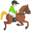
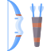

# Hey, I'm Alex.

Full stack developer at Hubelia, building production web apps in the cloud. I work on anything from e-commerce storefronts to complete internal management systems.

My main interest right now is agentic AI tooling built for developers. I focus on the engineering side, building structured workflows with isolated execution, validation, and safety gates at each step rather than vibe coding. I also work on CI/CD test automation and build automated reports that post directly to pull requests so teams can catch issues before merge.

Before software, I spent about ten years in industrial and logistics environments. It taught me how to work under pressure, stay disciplined, and care about what gets shipped.

The repos here are personal projects I can share publicly. My LinkedIn and portfolio have the rest.

## <a href='https://www.linkedin.com/in/AGilbertDev/'>LinkedIn</a>&emsp;<a href='https://agilbert.dev'>Portfolio</a>&emsp;<a href='https://leetcode.com/AGilbertDev'>Leetcode</a>

## Main stack

### Frontend

### Backend

### Tooling

## Hobbies

		
		
		
		
		
		
		
		
		

## Languages

		
		

