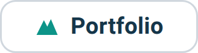
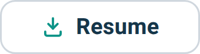

# Hey, I'm Alex 👋

**Full stack developer at Hubelia, based in Québec.**

I build and maintain production enterprise software, mostly custom ERPs and systems that manage logistics and production. My daily stack is TypeScript, Vue, Nuxt, and PostgreSQL.

AI is part of the job now, and using it well is what separates shipping quality software from pushing AI slop into the codebase. My team works with a spec-driven pipeline: specialized agents run in secure sandboxes and are gated by human review between steps. Since faster output raises the stakes on quality, I spend a lot of my free time on the testing pyramid and test automation. As a personal project, I built a GitHub Actions workflow that posts test results and coverage as a compact comment on every PR, so developers can self-correct before asking a colleague for review.

Before software, I spent 12+ years in factories, on production lines, and in warehouses. The work was demanding and the quality standards were high, and that discipline stayed with me. I still bring it to every project, along with a knack for finding solutions to the problems that hold up production.

The repos you see here are personal projects I can share publicly. The rest is top secret.

<a href="https://www.linkedin.com/in/AGilbertDev/"><picture><source media="(prefers-color-scheme: dark)" srcset="img/btn-linkedin-dark.png"></picture></a>
&nbsp;
<a href="https://agilbert.dev"><picture><source media="(prefers-color-scheme: dark)" srcset="img/btn-portfolio-dark.png"></picture></a>
&nbsp;
<a href="https://agilbert.dev/AlexandreGilbert_Resume.pdf"><picture><source media="(prefers-color-scheme: dark)" srcset="img/btn-resume-en-dark.png"></picture></a>

<a href="https://github.com/AGilbertDev/github-readme-stats">
  <picture>
    <source media="(prefers-color-scheme: dark)" srcset="https://github-readme-stats-alexandre-gilberts-projects.vercel.app/api/top-langs/?username=AGilbertDev&layout=compact&size_weight=0.5&count_weight=0.5&exclude_repo=ift3325-tp2%2Cift3913-tache3%2CARN%2CComplete-Web-Developer-Bootcamp-2024%2CCode-with-Mosh---React-Course%2Cgame-hub%2Cvue-games%2Cnuxt-travel-log%2Chyrule-jobs%2Creaction-time%2Cdojo-blog%2Cninja-jobs%2CTailwind-CSS-practice%2CJokesWebApp%2Cbasic-weather-app%2CSnake_Game%2CBasic-todo-list%2Cbun-elysia-prisma%2CDani-Krossing-PHP-Programming-for-Beginners-2023%2CAnimal_Refuge_App%2CAnimal_Refuge_App_2%2CMini-Game%2CDebugging-Challenge%2CStudent_Grading_App%2CPortfolio%2Cweb-form&hide_border=true&title_color=F4F4F5&icon_color=F4F4F5&text_color=F4F4F5&bg_color=00000000">
    
  </picture>
</a>

## Currently

- Deepening test automation and mutation testing (Vitest, Playwright, Stryker)
- Building reusable coding-agent recipes and specialist subagents for my spec-driven pipeline
- Shipping small tools that make the day-to-day developer experience faster

## Stack

- **Frontend:** Vue, Nuxt, TypeScript, Tailwind, PrimeVue, Nuxt UI, Pinia
- **Backend:** Bun, Elysia, PostgreSQL, SQLite, Drizzle, Meilisearch, Vercel
- **State & validation:** TanStack Query, Zod
- **Testing & CI:** Vitest, Playwright, Stryker, GitHub Actions, n8n

## Hobbies

Horseback riding, archery, kayaking, cross-country skiing, snowboarding, hiking, cycling, movies, and video games.

## Languages

Français (Québec) · English
