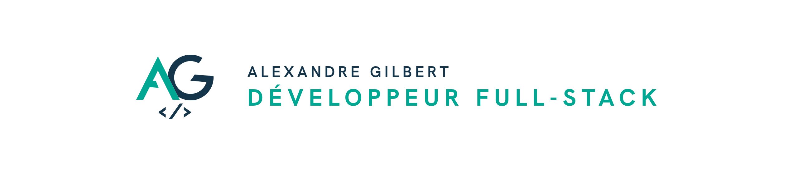
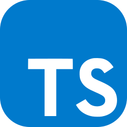
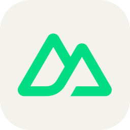
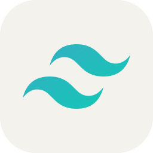
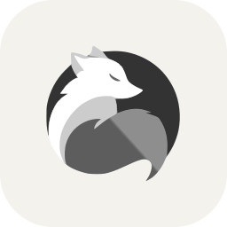
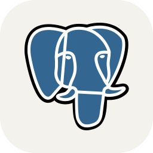
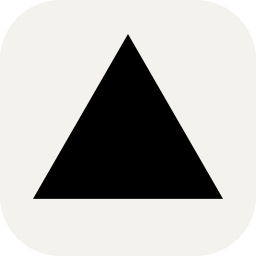
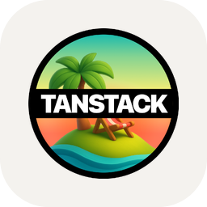

<picture>
  <source media="(prefers-color-scheme: dark)" srcset="img/readme-header-dark.png">
  
</picture>

# Hey, I'm Alex.

Full stack developer at Hubelia, building production web apps in the cloud. I work on anything from e-commerce storefronts to complete internal management systems.

My main work is full stack development. I try to use AI efficiently and integrate it into my dev workflow, exploring agent files, devcontainers, and workflow setups that make AI a useful productivity tool rather than a replacement. I've also set up automated testing and reports in CI so teams get clear feedback on every pull request.

Before software, I spent about ten years in industrial and logistics environments. It taught me how to work under pressure, stay disciplined, and care about what gets shipped.

The repos here are personal projects I can share publicly. My LinkedIn and portfolio have the rest.

&nbsp;

&nbsp;

<a href="https://github.com/AGilbertDev/github-readme-stats">
  <picture>
    <source media="(prefers-color-scheme: dark)" srcset="https://github-readme-stats-alexandre-gilberts-projects.vercel.app/api/top-langs/?username=AGilbertDev&layout=compact&size_weight=0.5&count_weight=0.5&exclude_repo=ift3325-tp2,ift3913-tache3,ARN,Complete-Web-Developer-Bootcamp-2024,Code-with-Mosh---React-Course,game-hub,vue-games,nuxt-travel-log,hyrule-jobs,reaction-time,dojo-blog,ninja-jobs,Tailwind-CSS-practice,JokesWebApp,basic-weather-app,Snake_Game,Basic-todo-list,bun-elysia-prisma,Dani-Krossing-PHP-Programming-for-Beginners-2023,Animal_Refuge_App,Animal_Refuge_App_2,Mini-Game,Debugging-Challenge,Student_Grading_App,Portfolio,web-form&hide_border=true&title_color=00A893&icon_color=00A893&text_color=F4F4F5&bg_color=00000000">
    
  </picture>
</a>

## Main stack

### Frontend
&emsp;&emsp;&emsp;&emsp;&emsp;

### Backend
&emsp;&emsp;&emsp;&emsp;&emsp;

### State & Validation
&emsp;

### Test Automation
&emsp;&emsp;&emsp;&emsp;

## Hobbies
&emsp;&emsp;&emsp;&emsp;&emsp;&emsp;&emsp;&emsp;

## Languages
&emsp;
