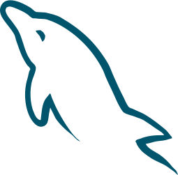

<h3>Bonjour! Je m'appelle Alexandre.</h3>

J'étudie en informatique à l'université de Montréal. J'adore coder des sites web et des applis pour android.

Ce que j'aime par dessus tout, c'est programmer des sites web ou des applications pour android.

<a href="https://agilbert.dev">Mon portfolio est ici!</a>

  
  
  
  
  
  
  
  
  
  
  
  
  
  

<a href="https://github.com/get-icon/geticon">Icônes par geticon.org</a>

Avec 7 ans d'expérience de travail après le cégep, dans des agences de placement, des entrepôts ou des usines comme Molson Coors, j'ai été contraint d'apprendre une tonne de tâches différentes et très rapidement, variant complètement d'une à l'autre. J'apprend très vite et je n'ai jamais de mal à faire ce qu'on m'a montré.

Je comprend très vite, donc mes superviseurs et chefs d'équipe me font facilement confiance. Ils me confient rapidement des tâches de plus qu'aux autres. Je me retrouve souvent dans une position où je corrige des erreurs ou bien je règle des problèmes qui font attendre tout le monde. J'ai parfois eu à former mes nouveaux coéquipiers.

J'ai eu la chance de travailler très longtemps en équipe, avec des personnalités complètement différentes! Je m'entend bien avec tout le monde. J'ai tendance à garder un oeil sur la réalisation du projet avant le reste. J'aime montrer que je reçois bien la critique et donner un retour rapidement. Sur des projets de jeux vidéo, par exemple, je me suis montré très proactif, pour respecter les contraintes artistiques ou techniques des projets. Je me suis fait dire à quelques reprises que j'étais rassembleur, ou que j'étais la colle qui tient l'équipe ensemble.

L'informatique est un milieur parfait pour moi et j'adore ce que je fais. Je souhaite utiliser ces qualités pour veiller à la réalisation de tous mes prochains projets, personnels ou dans les entreprises où je me rendrai.

